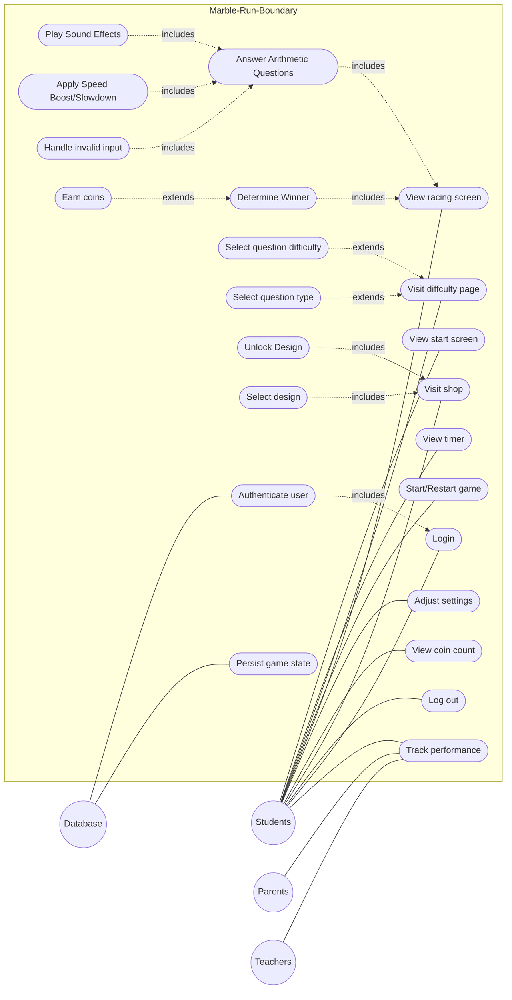

# Math Marble Race 2026

Wayne State University CSC 4110 project

Members:
Abubakar Babatunde
Jacob Cabrera
Anna Algobey
Thomas Errico-Seaman
Akaber Almahadi

## Use Case Diagram

```mermaid
flowchart LR
    %% Actors
    S((Students))
    P((Parents))
    T((Teachers))
    D((Database))

    %% System boundary
    subgraph System["Marble-Run-Boundary"]
        direction TB

        %% Student use cases
        UC1([View start screen])
        UC2([View timer])
        UC3([Visit diffculty page])
        UC4([Start/Restart game])
        UC5([View racing screen])
        UC6([Adjust settings])
        UC7([View coin count])
        UC8([Visit shop])
        UC9([Log out])
        UC10([Login])

        %% Included/extended use cases
        UC11([Answer Arithmetic Questions])
        UC12([Play Sound Effects])
        UC13([Apply Speed Boost/Slowdown])
        UC14([Handle invalid input])
        UC15([Determine Winner])
        UC16([Earn coins])
        UC17([Select question difficulty])
        UC18([Select question type])

        %% Shop-related use cases
        UC19([Unlock Design])
        UC20([Select design])

        %% Database use cases
        UC21([Authenticate user])
        UC22([Persist game state])

        %% Parent/Teacher/Student use case
        UC23([Track performance])

    end

    %% Student associations
    S --- UC1
    S --- UC2
    S --- UC3
    S --- UC4
    S --- UC5
    S --- UC6
    S --- UC7
    S --- UC8
    S --- UC9
    S --- UC10
    S --- UC23

    %% Database actor associations
    D --- UC21
    D --- UC22

    %% Parent & Teacher associations
    P --- UC23
    T --- UC23
    %% Relationships
    UC17 -.->|extends| UC3
    UC18 -.->|extends| UC3
    UC11 -.->|includes| UC5
    UC15 -.->|includes| UC5
    UC12 -.->|includes| UC11
    UC13 -.->|includes| UC11
    UC14 -.->|includes| UC11
    UC16 -.->|extends| UC15
    UC19 -.->|includes| UC8
    UC20 -.->|includes| UC8
    UC21 -.->|includes| UC10
```
